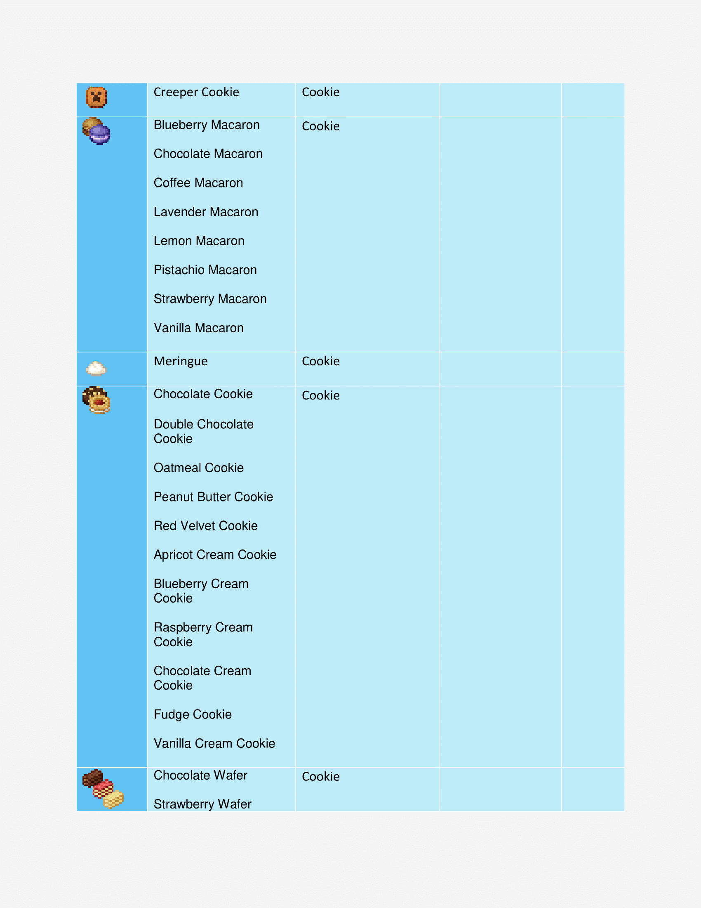
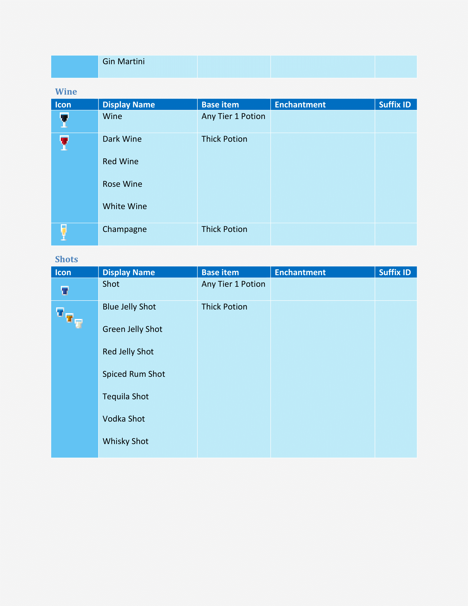

# Year971 Texture Pack
## Pacte de textura de recursos para minecraft 1.16.4

Year971 Texture Pack é um pacote de texturas e recursos compativel com minecraft 1.16 até 1.16.4, no qual reuno tudo o que encontro na internet que agregue ao jogo e que eu goste, ou seja, eu não desenhei nada neste pacote de textura e recursos, apenas reuni o que gostei e configurei corretamente para serem compativeis entre si, todos os creditos são de seus respectivos criadores, meus créditos são apenas por reunir e configurar todos os recursos de forma que não entrem em conflitos entre si.

## Recursos

Atualmente o pacote de texturas e recursos Year971 conta com
- Faithful 1.16 (Base)
https://faithful.team/
- Default Dark Mode (Aparencia dos Menus)
https://www.curseforge.com/minecraft/texture-packs/default-dark-mode
- Colourful Containers Dark (Aparencia dos Menus)
https://www.planetminecraft.com/texture-pack/colourful-containers-dark-mode-gui-optifine-required/
- Itembound 1.9 (Novos itens)
https://www.planetminecraft.com/texture-pack/itembound-fixed/
- Spawn Egg 3D (Para ovos de geração)
https://www.curseforge.com/minecraft/texture-packs/spawn-egg-3d
- Potion Icons (Para icones de poções e flechas encantadas)
https://www.planetminecraft.com/texture-pack/potion-icons-java-edition/
- Player Mob Models (para os mobs)
https://www.planetminecraft.com/texture-pack/cute-mob-models-resource-pack-my-own-version/
- Vanilla Tweaks (Recursos Extras)
https://vanillatweaks.net/picker/resource-packs/

### Lista de Recursos Extras :
.
 - -  DifferentStems
 - -  BetterParticles
 - -  HDShieldBanners
 - -  AnimatedCampfireItem
 - -  PolishedStonesToBricks
 - -  BushyLeaves
 - -  DarkerDarkOakLeaves
 - -  FancySunflowers
 - -  GrassSides
 - -  MyceliumSides
 - -  PathSides
 - -  PodzolSides
 - -  SnowSides
 - -  CrimsonNyliumSides
 - -  WarpedNyliumSides
 - -  QuieterMinecarts
 - -  OreBorders
 - -  VisualInfestedStoneItems
 - -  HungerPreview
 - -  StickyPistonSides
 - -  DirectionalHoppers
 - -  DirectionalDispensersDroppers
 - -  BetterObservers
 - -  GroovyLevers
 - -  CompassLodestone
 - -  BrewingGuideDark
 - -  VisualHoney
 - -  VisualCauldronStages
 - -  VisualComposterStages
 - -  VisualSaplingGrowth
 - -  NoteblockBanners
 - -  3DTiles
 - -  3DLadders
 - -  3DRails
 - -  3DSugarcane
 - -  3DIronBars
 - -  3DLilyPads
 - -  3DMushrooms
 - -  3DStonecutters
 - -  3DDoors&Trapdoors
 - -  3DVines
 - -  PingColorIndicator
 - -  NumberedHotbar
 - -  StandardGalactic
 - -  SGAToEnglish
 - -  DoubleSlabFix

Guia de uso do ItemBound

## Armamentos
### Classicos
|Icone|Nome|Item|Encantamento|
|--|--|--|-|
||Dagger|Qualquer Espada|-|
||Katana|Qualquer Espada|-|
||Longsword|Qualquer Espada|-|
||Nunchuck|Qualquer Espada|-|
||Rapier|Qualquer Espada|-|
||Spear|Qualquer Espada|-|
||Trident|Qualquer Espada|-|
||Battle Axe|Qualquer Machado|-|
||Scythe|Qualquer Machado|-|

 ### Arcos

|Icone|Nome|Item|Encantamento|
|--|--|--|--|
||Blaze Bow|Arco|Chama|
||Bluejay Bow|Arco|-|
||Cardinal Bow|Arco|-|
||Rain-Bow|Arco|Infinidade

### Espadas de Blocos
|Icone|Nome|Item|Encantamento|
|--|--|--|--|
||Bedrock Sword|Qualquer Espada|Inquebravel|
||Red Concrete Sword|Qualquer Espada|-|
||Orange Concrete Sword|Qualquer Espada|-|
||Yellow Concrete Sword|Qualquer Espada|-|
||Lime Concrete Sword|Qualquer Espada|-|
||Green Concrete Sword|Qualquer Espada|-|
||Cyan Concrete Sword|Qualquer Espada|-|
||Light-Blue Concrete Sword|Qualquer Espada|-|
||Blue Concrete Sword|Qualquer Espada|-|
||Purple Concrete Sword|Qualquer Espada|-|
||Magenta Concrete Sword|Qualquer Espada|-|
||Pink Concrete Sword|Qualquer Espada|-|
||Brown Concrete Sword|Qualquer Espada|-|
||White Concrete Sword|Qualquer Espada|-|
||Light-Gray Concrete Sword|Qualquer Espada|-|
||Gray Concrete Sword|Qualquer Espada|-|
||Black Concrete Sword|Qualquer Espada|-|
||Emerald Sword|Qualquer Espada|Saque|
||Glass Sword|Qualquer Espada|-|
||Nether Sword|Qualquer Espada|Aspecto Flamejante|
||Obsidian Sword|Qualquer Espada|Repulsão|
||Rainbow Sword|Qualquer Espada|-|
||Andesite Sword|Qualquer Espada|-|
||Diorite Sword|Qualquer Espada|-|
||Granite Sword|Qualquer Espada|-|
||Sandstone Sword|Qualquer Espada|-|
||Red Sandstone Sword|Qualquer Espada|-|

### Armas
|Icone|Nome|Item|Encantamento|
|--|--|--|--|
||Handgun|Arco|-|
||Viper|Arco|afiação|

### Fantasia
|Icone|Nome|Item|Encantamento|
|--|--|--|--|
||Dark Scythe|Qualquer Machado|Afiação|

### Legendarios
|Icone|Nome|Item|Encantamento|
|--|--|--|--|
||Excalibur|Qualquer Espada|-|

### Sabres de Luz
|Icone|Nome|Item|Encantamento|
|--|--|--|--|
||Green Lightsaber|Qualquer Espada|Afiação|
||Violet Lightsaber|Qualquer Espada|Afiação|
||Yellow Lightsaber|Qualquer Espada|Afiação|
||Red Lightsaber|Qualquer Espada|Afiação|
||Blue Lightsaber|Qualquer Espada|Afiação|

### Celulares
##### (Possivel Referencia a Mirai Nikki ?)
|Icone|Nome|Item|Encantamento|
|--|--|--|--|
||Black Smartphone|Arco||
||Silver Smartphone|Arco||
||Gold Smartphone|Arco||
||Rose Smartphone|Arco||
||Diamond Smartphone|Arco||

### Sobrevivente
|Icone|Nome|Item|Encantamento|
|--|--|--|--|
|-||||

## Guia para utilizar os novos itens

