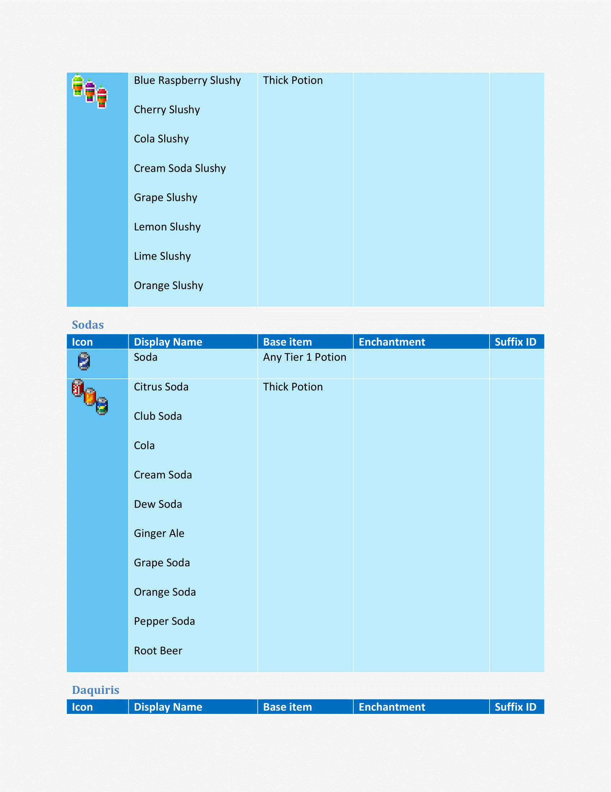

# Year971 Texture Pack

Year971 Texture Pack é um pacote de texturas e recursos compativel com minecraft 1.16 até 1.16.4, no qual reuno tudo o que encontro na internet que agregue ao jogo e que eu goste, ou seja, eu não desenhei nada neste pacote de textura e recursos, apenas reuni o que gostei e configurei corretamente para serem compativeis entre si, todos os creditos são de seus respectivos criadores, meus créditos são apenas por reunir e configurar todos os recursos de forma que não entrem em conflitos entre si.

Recursos

Atualmente o pacote de texturas e recursos Year971 conta com
- Faithful 1.16 (Base)
https://faithful.team/
- Default Dark Mode (Aparencia dos Menus)
https://www.curseforge.com/minecraft/texture-packs/default-dark-mode
- Colourful Containers Dark (Aparencia dos Menus)
https://www.planetminecraft.com/texture-pack/colourful-containers-dark-mode-gui-optifine-required/
- Itembound 1.9 (Novos itens)
https://www.planetminecraft.com/texture-pack/itembound-fixed/
- Spawn Egg 3D (Para ovos de geração)
https://www.curseforge.com/minecraft/texture-packs/spawn-egg-3d
- Potion Icons (Para icones de poções e flechas encantadas)
https://www.planetminecraft.com/texture-pack/potion-icons-java-edition/
- Player Mob Models (para os mobs)
https://www.planetminecraft.com/texture-pack/cute-mob-models-resource-pack-my-own-version/
- Vanilla Tweaks (Recursos Extras)
https://vanillatweaks.net/picker/resource-packs/

Recursos (sem link)

 - DifferentStems  
 - BetterParticles  
 - HDShieldBanners  
 - AnimatedCampfireItem  
 - PolishedStonesToBricks  
 - BushyLeaves  
 - DarkerDarkOakLeaves  
 - FancySunflowers  
 - GrassSides  
 - MyceliumSides  
 - PathSides  
 - PodzolSides  
 - SnowSides  
 - CrimsonNyliumSides  
 - WarpedNyliumSides  
 - QuieterMinecarts  
 - OreBorders  
 - VisualInfestedStoneItems  
 - HungerPreview  
 - StickyPistonSides  
 - DirectionalHoppers  
 - DirectionalDispensersDroppers  
 - BetterObservers  
 - GroovyLevers  
 - CompassLodestone  
 - BrewingGuideDark  
 - VisualHoney  
 - VisualCauldronStages  
 - VisualComposterStages  
 - VisualSaplingGrowth  
 - NoteblockBanners  
 - 3DTiles  
 - 3DLadders  
 - 3DRails  
 - 3DSugarcane  
 - 3DIronBars  
 - 3DLilyPads  
 - 3DMushrooms  
 - 3DStonecutters  
 - 3DDoors&Trapdoors  
 - 3DVines  
 - PingColorIndicator  
 - NumberedHotbar  
 - StandardGalactic  
 - SGAToEnglish  
 - DoubleSlabFix  
 

Guia de uso do ItemBound

# Índice
1. [Equipamentos & Armamentos](#equipamentos--armamentos "Equipamentos & Armamentos")  
1.1 [Classicos](#classicos "classicos")  
1.2 [Arcos](#arcos "Arcos")  
1.3 [Espadas de Bloco](#espadas-de-bloco "Espadas de Bloco")  
1.4 [Armas](#armas "Armas")  
1.5 [Fantasia](#fantasia "Fantasia")  
1.6 [Legendarios](#legendarios "Legendarios")  
1.7 [Sabres de Luz](#sabres-de-luz "Sabres de Luz")  
1.8 [Celulares](#celulares "Celulares")  
1.9 [Sobreviventes](#sobreviventes "Sobreviventes")  
1.10 [Video Game](#video-game "Video Game")  
1.11 [Pistolas D`agua](#pistolas-dagua "Pistolas Dagua")  
1.12 [Utensílios de Escrita](#utens%C3%ADlios-de-escrita "Utensílios de Escrita")  
1.13 [Isqueiros](#isqueiros "Isqueiros")  
1.14 [Fidget Spinners](#fidget-spinners "Fidget Spinners")  
1.15 [Picaretas](#picaretas "Picaretas")  
1.16 [Pá](#pa "Pá")  
1.17 [Tesouras](#tesouras "Tesouras")  
2. [Escudos](#escudos "Escudos")  
2.1 [Pranchas](#pranchas "Pranchas")  
2.2 [Escudos de Madeira](#escudos-de-madeira "Escudos de Madeira")  
3. [Armaduras](#armaduras "Armaduras")  
3.1 [Capas](#capas "Capas")  
3.2 [Fantasias](#fantasias "Fantasias")  
3.3 [Power Rangers](#power-rangers "Power Rangers")  
3.4 [Armadura Invisivel](#armadura-invisivel "Armadura Invisivel")  
3.5 [Armadura Minecraft](#armadura-minecraft "Armadura Minecraft")  
 

## Equipamentos & Armamentos
### Classicos
|Icone|Nome|Item|Encantamento|
|--|--|--|-|
||Dagger|Qualquer Espada|-|
||Katana|Qualquer Espada|-|
||Longsword|Qualquer Espada|-|
||Nunchuck|Qualquer Espada|-|
||Rapier|Qualquer Espada|-|
||Spear|Qualquer Espada|-|
||Trident|Qualquer Espada|-|
||Battle Axe|Qualquer Machado|-|
||Scythe|Qualquer Machado|-|

 ### Arcos

|Icone|Nome|Item|Encantamento|
|--|--|--|--|
||Blaze Bow|Arco|Chama|
||Bluejay Bow|Arco|-|
||Cardinal Bow|Arco|-|
||Rain-Bow|Arco|Infinidade

### Espadas de Blocos
|Icone|Nome|Item|Encantamento|
|--|--|--|--|
||Bedrock Sword|Qualquer Espada|Inquebravel|
||Red Concrete Sword|Qualquer Espada|-|
||Orange Concrete Sword|Qualquer Espada|-|
||Yellow Concrete Sword|Qualquer Espada|-|
||Lime Concrete Sword|Qualquer Espada|-|
||Green Concrete Sword|Qualquer Espada|-|
||Cyan Concrete Sword|Qualquer Espada|-|
||Light-Blue Concrete Sword|Qualquer Espada|-|
||Blue Concrete Sword|Qualquer Espada|-|
||Purple Concrete Sword|Qualquer Espada|-|
||Magenta Concrete Sword|Qualquer Espada|-|
||Pink Concrete Sword|Qualquer Espada|-|
||Brown Concrete Sword|Qualquer Espada|-|
||White Concrete Sword|Qualquer Espada|-|
||Light-Gray Concrete Sword|Qualquer Espada|-|
||Gray Concrete Sword|Qualquer Espada|-|
||Black Concrete Sword|Qualquer Espada|-|
||Emerald Sword|Qualquer Espada|Saque|
||Glass Sword|Qualquer Espada|-|
||Nether Sword|Qualquer Espada|Aspecto Flamejante|
||Obsidian Sword|Qualquer Espada|Repulsão|
||Rainbow Sword|Qualquer Espada|-|
||Andesite Sword|Qualquer Espada|-|
||Diorite Sword|Qualquer Espada|-|
||Granite Sword|Qualquer Espada|-|
||Sandstone Sword|Qualquer Espada|-|
||Red Sandstone Sword|Qualquer Espada|-|

### Armas
|Icone|Nome|Item|Encantamento|
|--|--|--|--|
||Handgun|Arco|-|
||Viper|Arco|afiação|

### Fantasia
|Icone|Nome|Item|Encantamento|
|--|--|--|--|
||Dark Scythe|Qualquer Machado|Afiação|

### Legendarios
|Icone|Nome|Item|Encantamento|
|--|--|--|--|
||Excalibur|Qualquer Espada|-|

### Sabres de Luz
|Icone|Nome|Item|Encantamento|
|--|--|--|--|
||Green Lightsaber|Qualquer Espada|Afiação|
||Violet Lightsaber|Qualquer Espada|Afiação|
||Yellow Lightsaber|Qualquer Espada|Afiação|
||Red Lightsaber|Qualquer Espada|Afiação|
||Blue Lightsaber|Qualquer Espada|Afiação|

### Celulares
##### (Possivel Referencia a Mirai Nikki ?)
|Icone|Nome|Item|Encantamento|
|--|--|--|--|
||Black Smartphone|Arco||
||Silver Smartphone|Arco||
||Gold Smartphone|Arco||
||Rose Smartphone|Arco||
||Diamond Smartphone|Arco||

### Sobrevivente
|Icone|Nome|Item|Encantamento|
|--|--|--|--|
||1000 Degree Knife|Qualquer Espada|Aspecto Flamejante|
||Apple Pen|Qualquer Espada|-|
||Pineapple Pen|Qualquer Espada|-|
||Pen Pineapple Apple Pen|Qualquer Espada|-|
||Brick|Qualquer Espada|-|
||Twig|Qualquer Espada|-|
||Wooden Bat|Qualquer Espada|-|
||Iron Bat|Qualquer Espada|-|
||Knife|Qualquer Espada|-|
||Microfone|Qualquer Espada|-|
||Green Paintbrush|Qualquer Espada|-|
||Violet Paintbrush|Qualquer Espada|-|
||Yellow Paintbrush|Qualquer Espada|-|
||Red Paintbrush|Qualquer Espada|-|
||Blue Paintbrush|Qualquer Espada|-|
||Green Pinwheel|Qualquer Espada|-|
||Pink Pinwheel|Qualquer Espada|-|
||Yellow Pinwheel|Qualquer Espada|-|
||Red Pinwheel|Qualquer Espada|-|
||Blue Pinwheel|Qualquer Espada|-|
||Green Racket|Qualquer Espada|-|
||Red Racket|Qualquer Espada|-|
||Bus Stop Sign|Qualquer Espada|-|
||Stop Sign|Qualquer Espada|-|
||Work Sign|Qualquer Espada|-|

### Video Game
|Icone|Nome|Item|Encantamento|
|--|--|--|--|
||Buster Sword|Qualquer Espada|Repulsão|

### Pistolas D'agua
|Icone|Nome|Item|Encantamento|
|--|--|--|--|
||Blue Water Gun|Arco|-|
||Green Water Gun|Arco|-|
||Orange Water Gun|Arco|-|
||Pink Water Gun|Arco|-|

### Utensílios de Escrita
|Icone|Nome|Item|Encantamento|
|--|--|--|--|
||Blue Pencil|Qualquer Espada|-|
||Green Pencil|Qualquer Espada|-|
||Red Pencil|Qualquer Espada|-|
||Yellow Pencil|Qualquer Espada|-|
||Blue Marker|Qualquer Espada|-|
||Green Marker|Qualquer Espada|-|
||Red Marker|Qualquer Espada|-|
||Yellow Marker|Qualquer Espada|-|
||Blue Pen|Qualquer Espada|-|
||Green Pen|Qualquer Espada|-|
||Red Pen|Qualquer Espada|-|
||Violet Pen|Qualquer Espada|-|
||Blue Quill|Qualquer Espada|-|
||Green Quill|Qualquer Espada|-|
||Red Quill|Qualquer Espada|-|
||Yellow Quill|Qualquer Espada|-|
||Blue Fountain pen|Qualquer Espada|-|
||Green Fountain pen|Qualquer Espada|-|
||Red Fountain pen|Qualquer Espada|-|
||Yellow Fountain pen|Qualquer Espada|-|

### Isqueiros
|Icone|Nome|Item|Encantamento|
|--|--|--|--|
||Red Lighter|Pederneira||
||Orange Lighter|Pederneira||
||Yellow Lighter|Pederneira||
||Green Lighter|Pederneira||
||Blue Lighter|Pederneira||
||Violet Lighter|Pederneira||
||Pink Lighter|Pederneira||
||White Lighter|Pederneira||
||Black Lighter|Pederneira||

### Fidget Spinners
|Icone|Nome|Item|Encantamento|
|--|--|--|--|
||Red Fidget Spinner|Vara de Pescar|-|
||Orange Fidget Spinner|Vara de Pescar|-|
||Yellow Fidget Spinner|Vara de Pescar|-|
||Green Fidget Spinner|Vara de Pescar|-|
||Blue Fidget Spinner|Vara de Pescar|-|
||Violet Fidget Spinner|Vara de Pescar|-|
||Pink Fidget Spinner|Vara de Pescar|-|
||White Fidget Spinner|Vara de Pescar|-|
||Black Fidget Spinner|Vara de Pescar|-|

### Picaretas
|Icone|Nome|Item|Encantamento|
|--|--|--|--|
||Drill|Picareta de Ferro|Eficiencia|
||Drill|Picareta de Ouro|Eficiencia|
||Drill|Picareta de Diamante|Eficiencia|
||Fork|Qualquer Picareta|-|

### Pá
|Icone|Nome|Item|Encantamento|
|--|--|--|--|
||Spoon|Qualquer Pá|-|

### Tesouras
|Icone|Nome|Item|Encantamento|
|--|--|--|--|
||Razor|Tesoura|-|
||Blue Scissors|Tesoura|-|
||Green Scissors|Tesoura|-|
||Red Scissors|Tesoura|-|

## Escudos
### Pranchas
|Icone|Nome|Item|Encantamento|
|--|--|--|--|
||Red Bodyboard|Escudo|-|
||Yellow Bodyboard|Escudo|-|
||Green Bodyboard|Escudo|-|
||Blue Bodyboard|Escudo|-|
||Purple Bodyboard|Escudo|-|
||Pink Bodyboard|Escudo|-|
||Black Bodyboard|Escudo|-|

### Escudos de Madeira
|Icone|Nome|Item|Encantamento|
|--|--|--|--|
||Birch Log Shield|Escudo|-|
||Oak Log Shield|Escudo|-|
||Jungle Log Shield|Escudo|-|
||Acacia Log Shield|Escudo|-|
||Spruce Log Shield|Escudo|-|
||Dark Oak Log Shield|Escudo|-|

## Armaduras
### Capas
|Icone|Nome|Item|Encantamento|
|--|--|--|--|
||Plain Cape|Armadura de Couro|-|
||Rainbow Cape|Qualquer Armadura|-|
||Blue Haven Cape|Qualquer Armadura|-|
||ItemBound Cape|Qualquer Armadura|-|
||Blaze Cape|Qualquer Armadura|Proteção Contra Fogo|
||Creeper Cape|Qualquer Armadura|Proteção Contra Explosão|
||Cross Cape|Qualquer Armadura|Proteção|
||Curse Cape|Qualquer Armadura|Espinhos|

### Fantasias
|Icone|Nome|Item|Encantamento|
|--|--|--|--|
||Cat Ears|Capacete de Couro|-|
||Gold Cat Ears|Qualquer Capacete|-|
||Zombie Cat Ears|Qualquer Capacete|-|
||Calico Cat Ears|Qualquer Capacete|-|
||Diamond Cat Ears|Qualquer Capacete|-|
||Halo|Qualquer Capacete|Proteção|
||Black Striped Socks|Calça de Couro|-|
||White Striped Socks|Calça de Couro|-|
||Rainbow Socks|Qualquer Calça|-|
||Pastel Rainbow Socks|Qualquer Calça|-|

### Power Ranger
|Icone|Nome|Item|Encantamento|
|--|--|--|--|
||&#60;cor&#62; Power Crafter Helmet|Qualquer Capacete|-|
||&#60;cor&#62; Power Crafter Chestplate|Qualquer Peitoral|-|
||&#60;cor&#62; Power Crafter Leggings|Qualquer Calça|-|
||&#60;cor&#62; Power Crafter Boots|Qualquer Bota|-|
###### Cores: Blue, Green, Yellow, Red, Pink | Exemplo: Red Power Crafter Helmet

### Armadura Invisivel
|Icone|Nome|Item|Encantamento|
|--|--|--|--|
||Invisible Helmet|Qualquer Capacete|-|
||Invisible Chestplate|Qualquer Peitoral|-|
||Invisible Leggings|Qualquer Calça|-|
||Invisible Boots|Qualquer Bota|-|

### Armadura "Minecraft"
|Icone|Nome|Item|Encantamento|
|--|--|--|--|
||Slime Helmet|Capacete de Couro|-|
||Slime Top|Peitoral de Couro|-|
||Slime Pants|Calça de Couro|-|
||Slime Boots|Bota de Couro|-|

# <!-- 
 -->

Guia de uso do ItemBound

## Armamentos
### Classicos
|Icone|Nome|Item|Encantamento|
|--|--|--|-|
||Dagger|Qualquer Espada|-|
||Katana|Qualquer Espada|-|
||Longsword|Qualquer Espada|-|
||Nunchuck|Qualquer Espada|-|
||Rapier|Qualquer Espada|-|
||Spear|Qualquer Espada|-|
||Trident|Qualquer Espada|-|
||Battle Axe|Qualquer Machado|-|
||Scythe|Qualquer Machado|-|

 ### Arcos

|Icone|Nome|Item|Encantamento|
|--|--|--|--|
||Blaze Bow|Arco|Chama|
||Bluejay Bow|Arco|-|
||Cardinal Bow|Arco|-|
||Rain-Bow|Arco|Infinidade

### Espadas de Blocos
|Icone|Nome|Item|Encantamento|
|--|--|--|--|
||Bedrock Sword|Qualquer Espada|Inquebravel|
||Red Concrete Sword|Qualquer Espada|-|
||Orange Concrete Sword|Qualquer Espada|-|
||Yellow Concrete Sword|Qualquer Espada|-|
||Lime Concrete Sword|Qualquer Espada|-|
||Green Concrete Sword|Qualquer Espada|-|
||Cyan Concrete Sword|Qualquer Espada|-|
||Light-Blue Concrete Sword|Qualquer Espada|-|
||Blue Concrete Sword|Qualquer Espada|-|
||Purple Concrete Sword|Qualquer Espada|-|
||Magenta Concrete Sword|Qualquer Espada|-|
||Pink Concrete Sword|Qualquer Espada|-|
||Brown Concrete Sword|Qualquer Espada|-|
||White Concrete Sword|Qualquer Espada|-|
||Light-Gray Concrete Sword|Qualquer Espada|-|
||Gray Concrete Sword|Qualquer Espada|-|
||Black Concrete Sword|Qualquer Espada|-|
||Emerald Sword|Qualquer Espada|Saque|
||Glass Sword|Qualquer Espada|-|
||Nether Sword|Qualquer Espada|Aspecto Flamejante|
||Obsidian Sword|Qualquer Espada|Repulsão|
||Rainbow Sword|Qualquer Espada|-|
||Andesite Sword|Qualquer Espada|-|
||Diorite Sword|Qualquer Espada|-|
||Granite Sword|Qualquer Espada|-|
||Sandstone Sword|Qualquer Espada|-|
||Red Sandstone Sword|Qualquer Espada|-|

### Armas
|Icone|Nome|Item|Encantamento|
|--|--|--|--|
||Handgun|Arco|-|
||Viper|Arco|afiação|

### Fantasia
|Icone|Nome|Item|Encantamento|
|--|--|--|--|
||Dark Scythe|Qualquer Machado|Afiação|

### Legendarios
|Icone|Nome|Item|Encantamento|
|--|--|--|--|
||Excalibur|Qualquer Espada|-|

### Sabres de Luz
|Icone|Nome|Item|Encantamento|
|--|--|--|--|
||Green Lightsaber|Qualquer Espada|Afiação|
||Violet Lightsaber|Qualquer Espada|Afiação|
||Yellow Lightsaber|Qualquer Espada|Afiação|
||Red Lightsaber|Qualquer Espada|Afiação|
||Blue Lightsaber|Qualquer Espada|Afiação|

### Celulares
##### (Possivel Referencia a Mirai Nikki ?)
|Icone|Nome|Item|Encantamento|
|--|--|--|--|
||Black Smartphone|Arco||
||Silver Smartphone|Arco||
||Gold Smartphone|Arco||
||Rose Smartphone|Arco||
||Diamond Smartphone|Arco||

### Sobrevivente
|Icone|Nome|Item|Encantamento|
|--|--|--|--|
||1000 Degree Knife|Qualquer Espada|Aspecto Flamejante|
||Apple Pen|Qualquer Espada|-|
||Pineapple Pen|Qualquer Espada|-|
||Pen Pineapple Apple Pen|Qualquer Espada|-|
||Brick|Qualquer Espada|-|
||Twig|Qualquer Espada|-|
||Wooden Bat|Qualquer Espada|-|
||Iron Bat|Qualquer Espada|-|
||Knife|Qualquer Espada|-|
||Microfone|Qualquer Espada|-|
||Green Paintbrush|Qualquer Espada|-|
||Violet Paintbrush|Qualquer Espada|-|
||Yellow Paintbrush|Qualquer Espada|-|
||Red Paintbrush|Qualquer Espada|-|
||Blue Paintbrush|Qualquer Espada|-|
||Green Pinwheel|Qualquer Espada|-|
||Pink Pinwheel|Qualquer Espada|-|
||Yellow Pinwheel|Qualquer Espada|-|
||Red Pinwheel|Qualquer Espada|-|
||Blue Pinwheel|Qualquer Espada|-|
||Green Racket|Qualquer Espada|-|
||Red Racket|Qualquer Espada|-|
||Bus Stop Sign|Qualquer Espada|-|
||Stop Sign|Qualquer Espada|-|
||Work Sign|Qualquer Espada|-|

### Video Game
|Icone|Nome|Item|Encantamento|
|--|--|--|--|
||Buster Sword|Qualquer Espada|Repulsão|

### Pistolas D'agua
|Icone|Nome|Item|Encantamento|
|--|--|--|--|
||Blue Water Gun|Arco|-|
||Green Water Gun|Arco|-|
||Orange Water Gun|Arco|-|
||Pink Water Gun|Arco|-|

### Utensílios de Escrita
|Icone|Nome|Item|Encantamento|
|--|--|--|--|
||Blue Pencil|Qualquer Espada|-|
||Green Pencil|Qualquer Espada|-|
||Red Pencil|Qualquer Espada|-|
||Yellow Pencil|Qualquer Espada|-|
||Blue Marker|Qualquer Espada|-|
||Green Marker|Qualquer Espada|-|
||Red Marker|Qualquer Espada|-|
||Yellow Marker|Qualquer Espada|-|
||Blue Pen|Qualquer Espada|-|
||Green Pen|Qualquer Espada|-|
||Red Pen|Qualquer Espada|-|
||Violet Pen|Qualquer Espada|-|
||Blue Quill|Qualquer Espada|-|
||Green Quill|Qualquer Espada|-|
||Red Quill|Qualquer Espada|-|
||Yellow Quill|Qualquer Espada|-|
||Blue Fountain pen|Qualquer Espada|-|
||Green Fountain pen|Qualquer Espada|-|
||Red Fountain pen|Qualquer Espada|-|
||Yellow Fountain pen|Qualquer Espada|-|

### Isqueiros
|Icone|Nome|Item|Encantamento|
|--|--|--|--|
||Red Lighter|Pederneira||
||Orange Lighter|Pederneira||
||Yellow Lighter|Pederneira||
||Green Lighter|Pederneira||
||Blue Lighter|Pederneira||
||Violet Lighter|Pederneira||
||Pink Lighter|Pederneira||
||White Lighter|Pederneira||
||Black Lighter|Pederneira||

### Fidget Spinners
|Icone|Nome|Item|Encantamento|
|--|--|--|--|
||Red Fidget Spinner|Vara de Pescar|-|
||Orange Fidget Spinner|Vara de Pescar|-|
||Yellow Fidget Spinner|Vara de Pescar|-|
||Green Fidget Spinner|Vara de Pescar|-|
||Blue Fidget Spinner|Vara de Pescar|-|
||Violet Fidget Spinner|Vara de Pescar|-|
||Pink Fidget Spinner|Vara de Pescar|-|
||White Fidget Spinner|Vara de Pescar|-|
||Black Fidget Spinner|Vara de Pescar|-|

### Picaretas
|Icone|Nome|Item|Encantamento|
|--|--|--|--|
||Drill|Picareta de Ferro|Eficiencia|
||Drill|Picareta de Ouro|Eficiencia|
||Drill|Picareta de Diamante|Eficiencia|
||Fork|Qualquer Picareta|-|

### Pá
|Icone|Nome|Item|Encantamento|
|--|--|--|--|
||Spoon|Qualquer Pá|-|

### Tesouras
|Icone|Nome|Item|Encantamento|
|--|--|--|--|
||Razor|Tesoura|-|
||Blue Scissors|Tesoura|-|
||Green Scissors|Tesoura|-|
||Red Scissors|Tesoura|-|

## Escudos
### Pranchas
|Icone|Nome|Item|Encantamento|
|--|--|--|--|
||Red Bodyboard|Escudo|-|
||Yellow Bodyboard|Escudo|-|
||Green Bodyboard|Escudo|-|
||Blue Bodyboard|Escudo|-|
||Purple Bodyboard|Escudo|-|
||Pink Bodyboard|Escudo|-|
||Black Bodyboard|Escudo|-|

### Escudos de Madeira
|Icone|Nome|Item|Encantamento|
|--|--|--|--|
||Birch Log Shield|Escudo|-|
||Oak Log Shield|Escudo|-|
||Jungle Log Shield|Escudo|-|
||Acacia Log Shield|Escudo|-|
||Spruce Log Shield|Escudo|-|
||Dark Oak Log Shield|Escudo|-|

## Armaduras
### Capas
|Icone|Nome|Item|Encantamento|
|--|--|--|--|
||Plain Cape|Armadura de Couro|-|
||Rainbow Cape|Qualquer Armadura|-|
||Blue Haven Cape|Qualquer Armadura|-|
||ItemBound Cape|Qualquer Armadura|-|
||Blaze Cape|Qualquer Armadura|Proteção Contra Fogo|
||Creeper Cape|Qualquer Armadura|Proteção Contra Explosão|
||Cross Cape|Qualquer Armadura|Proteção|
||Curse Cape|Qualquer Armadura|Espinhos|

### Fantasias
|Icone|Nome|Item|Encantamento|
|--|--|--|--|
||Cat Ears|Capacete de Couro|-|
||Gold Cat Ears|Qualquer Capacete|-|
||Zombie Cat Ears|Qualquer Capacete|-|
||Calico Cat Ears|Qualquer Capacete|-|
||Diamond Cat Ears|Qualquer Capacete|-|
||Halo|Qualquer Capacete|Proteção|
||Black Striped Socks|Calça de Couro|-|
||White Striped Socks|Calça de Couro|-|
||Rainbow Socks|Qualquer Calça|-|
||Pastel Rainbow Socks|Qualquer Calça|-|

### Power Ranger
|Icone|Nome|Item|Encantamento|
|--|--|--|--|
||&#60;cor&#62; Power Crafter Helmet|Qualquer Capacete|-|
||&#60;cor&#62; Power Crafter Chestplate|Qualquer Peitoral|-|
||&#60;cor&#62; Power Crafter Leggings|Qualquer Calça|-|
||&#60;cor&#62; Power Crafter Boots|Qualquer Bota|-|
###### Cores: Blue, Green, Yellow, Red, Pink | Exemplo: Red Power Crafter Helmet

### Armadura Invisivel
|Icone|Nome|Item|Encantamento|
|--|--|--|--|
||Invisible Helmet|Qualquer Capacete|-|
||Invisible Chestplate|Qualquer Peitoral|-|
||Invisible Leggings|Qualquer Calça|-|
||Invisible Boots|Qualquer Bota|-|

### Armadura "Minecraft"
|Icone|Nome|Item|Encantamento|
|--|--|--|--|
||Slime Helmet|Capacete de Couro|-|
||Slime Top|Peitoral de Couro|-|
||Slime Pants|Calça de Couro|-|
||Slime Boots|Bota de Couro|-|

Prints ItemBound

 
## Guia para utilizar os novos itens

 

