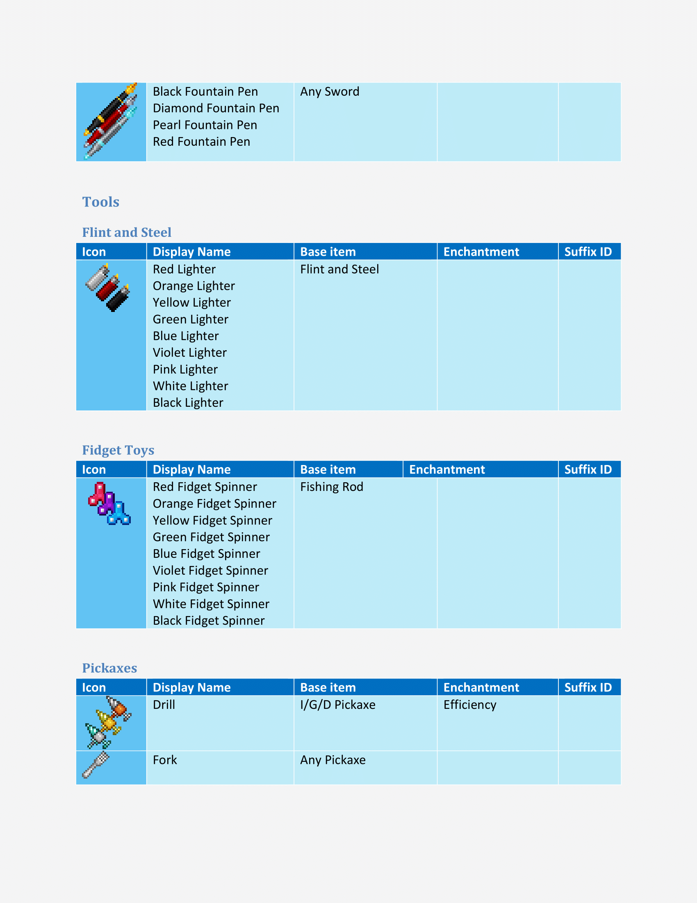

# Year971 Texture Pack
## Pacte de textura de recursos para minecraft 1.16.4

Year971 Texture Pack é um pacote de texturas e recursos compativel com minecraft 1.16 até 1.16.4, no qual reuno tudo o que encontro na internet que agregue ao jogo e que eu goste, ou seja, eu não desenhei nada neste pacote de textura e recursos, apenas reuni o que gostei e configurei corretamente para serem compativeis entre si, todos os creditos são de seus respectivos criadores, meus créditos são apenas por reunir e configurar todos os recursos de forma que não entrem em conflitos entre si.

## Recursos

Atualmente o pacote de texturas e recursos Year971 conta com
- Faithful 1.16 (Base)
https://faithful.team/
- Itembound 1.9 (Novos itens)
https://www.planetminecraft.com/texture-pack/itembound-fixed/
- Spawn Egg 3D (Para ovos de geração)
https://www.curseforge.com/minecraft/texture-packs/spawn-egg-3d
- Potion Icons (Para icones de poções e flechas encantadas)
https://www.planetminecraft.com/texture-pack/potion-icons-java-edition/
- Player Mob Models (para os mobs)
https://www.planetminecraft.com/texture-pack/cute-mob-models-resource-pack-my-own-version/
- Vanilla Tweaks (Recursos Extras)
https://vanillatweaks.net/picker/resource-packs/

### Lista de Recursos Extras :
.
> DifferentStems
> BetterParticles
> HDShieldBanners
> AnimatedCampfireItem
> PolishedStonesToBricks
> BushyLeaves
> DarkerDarkOakLeaves
> FancySunflowers
> GrassSides
> MyceliumSides
> PathSides
> PodzolSides
> SnowSides
> CrimsonNyliumSides
> WarpedNyliumSides
> QuieterMinecarts
> OreBorders
> VisualInfestedStoneItems
> HungerPreview
> StickyPistonSides
> DirectionalHoppers
> DirectionalDispensersDroppers
> BetterObservers
> GroovyLevers
> CompassLodestone
> BrewingGuideDark
> VisualHoney
> VisualCauldronStages
> VisualComposterStages
> VisualSaplingGrowth
> NoteblockBanners
> 3DTiles
> 3DLadders
> 3DRails
> 3DSugarcane
> 3DIronBars
> 3DLilyPads
> 3DMushrooms
> 3DStonecutters
> 3DDoors&Trapdoors
> 3DVines
> PingColorIndicator
> NumberedHotbar
> StandardGalactic
> SGAToEnglish
> DoubleSlabFix

## Guia para utilizar os novos itens

